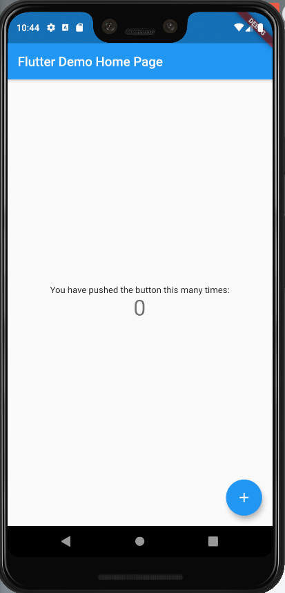

# covid19

A new Flutter project.

## Lista de Requerimientos

- La aplicación mostrará todos los casos de coronavirus tanto a nivel nacional como departamental.
- La aplicación mostrara graficos estadisticos en porcentaje de los casos de coronavirus.
- La aplicación mostrará graficos donde se verá el crecimiento (esto de los ultimos 10 o 20 dias) de casos de coronavirus tanto a nivel nacional como departamental.
- La aplicación mostrará tips de prevención.
- La aplicación mostrará recomendaciones e información sobre el coronavirus.
- La aplicación mostrará información sobre los sintomas de coronavirus.
- La aplicación mostrará anuncios de tanto del gobierno nacional y gobierno autonomo departamental.
- La aplicación informara números de emergencia los cuales se podrán llamar desde la aplicación.
- PLUS: La aplicación podrá realizar un test del coronavirus. (Si es que se puede).

## Creando el proyecto

>```comand line
>flutter create --androidx -a kotlin -i swift covid19
>```

<p align="center">
  
</p>